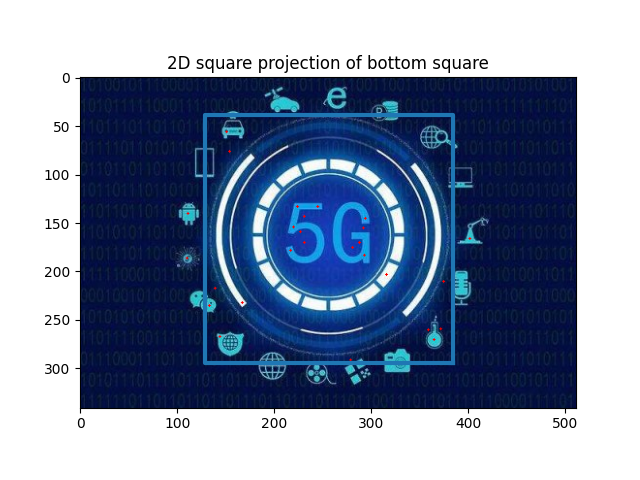
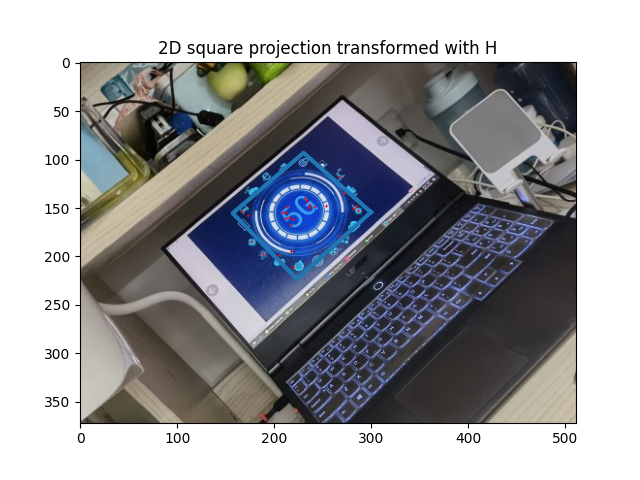
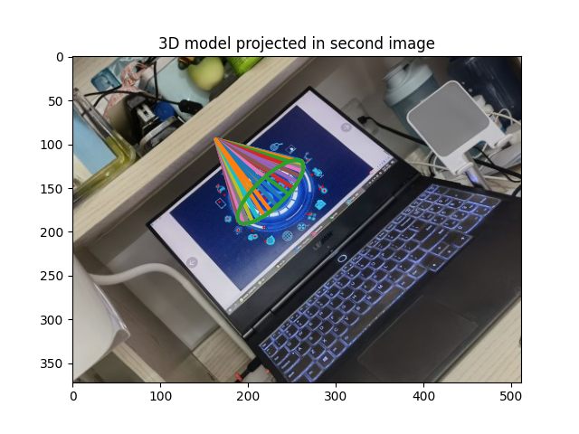
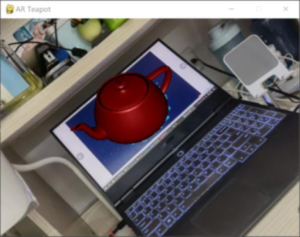

# Introduction

This project implements a AR demo, which can locate the original image in the object image and figure out the rotate matrix. Then we project a 3D model on the object image, which contribute a AR project.

### start file

***AR.py***

### TODO

Put your image in **img_resource** and your obj file in **obj_resource**, and correct the file name in ***AR.py***

# Requirements

```
pip install opencv
pip install PCV
pip install pygame
pip install PyOpenGL PyOpenGL_accelerate
```

# Demo

2D square projection of bottom square



2D square projection transformed with H



3D model projected in second image



AR Teapot




# Author

Yu Yan PB18051165

# Reference

[SIFT](https://blog.csdn.net/sakurakawa/article/details/120833167?ops_request_misc=%257B%2522request%255Fid%2522%253A%2522163828707416780261930059%2522%252C%2522scm%2522%253A%252220140713.130102334.pc%255Fblog.%2522%257D&request_id=163828707416780261930059&biz_id=0&utm_medium=distribute.pc_search_result.none-task-blog-2~blog~first_rank_v2~rank_v29-1-120833167.pc_v2_rank_blog_default&utm_term=SIFT%E6%BA%90%E7%A0%81%EF%BC%88python%E5%AE%9E%E7%8E%B0%EF%BC%89) 

[Teapot demo](https://blog.csdn.net/qq_42617827/article/details/89052267)

